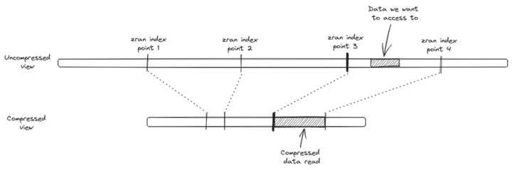

# netcdf-streaming

## Description
### Introduction

We propose a novel approach designed to improve access to time series from native NetCDF files. The advantage of our approach is that it preserves existing data without requiring any reformatting. The goal is to reduce the amount of data read from the NetCDF file. To achieve this, our method creates virtual sub-chunks that can be read independently.

This novel approach, called ChunkIndex, involves indexing data within compressed NetCDF chunks, enabling the extraction of smaller compressed data portions without reading the entire chunk or the need to reformat the existing files.

This feature is particularly valuable for accessing time series or for extracting small amounts of data from datasets with large chunks.

### Some definitions
- Chunk :
a portion of data in the netCDF file that can be read or written as a single I/O operation The data
compression is applied to full chunks
- Sub-chunk :
a smaller portion of data that can be read using chunkindex approach

### How do we do that ?
1. We build an index that contains 32 KB windows of compressed data at some points in the chunk (e g zran
index points 1 to 4 The 32 KB windows are the decompression context for the deflate algorithm They are
necessary to start the decompression from these intermediate points

2. We identify the index point that lies just before the data we want to extract (e g point 3 and read the
associated 32 KB window from the index

3. We initialize the decompression from this index point 3

4. We decompress the sub chunk to retrieve the data we need



## Dependancies

chunkindex librairies needs these python packages :
- python=3.10
- zran
- numpy
- h5py
- xarray


## How to use


```
export PYTHONPATH=[PATH_TO_REPO]
```

In your python script :
```
import chunkindex


chunkindex.create_index(index_filename, dataset_filename)

variable = 'variable_name'
# slice structure, for instance retrieve (0:72, 280:290, 100:110) from a 3D variable
slice_data = (slice(0,72), slice(280,290), slice(100,110))

with  open(dataset_filename, 'rb') as dataset:
    with open(index_filename, mode='rb') as index:
        data = chunkindex.read_slice(dataset, index, variable, slice_data)


```

## references

see :

https://meetingorganizer.copernicus.org/EGU25/EGU25-1294.html

